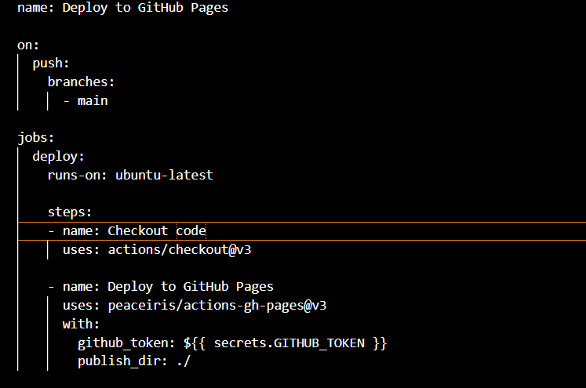

# SE-Assignment-4
Assignment: GitHub and Visual Studio
Instructions:
Answer the following questions based on your understanding of GitHub and Visual Studio. Provide detailed explanations and examples where appropriate.

Questions:
Introduction to GitHub:

What is GitHub, and what are its primary functions and features? Explain how it supports collaborative software development.

      GitHub is a web-based platform that provides version control and collaborative software development services. It ustilizes Git which an open-source distributed version control system used to track changes in source code during the process of software development.

      Primary Functions and Features:
         1.Version Control with Git:Repositories, Commits and Branches
         2.Collaboration Tools:Pull Requests, Code Review and Issues and Project Management.
         3.Documentation and Communication:README Files and Wikis.
         4.Security and Permissions:Access Control and Security Alerts.
         5.Continuous Integration and Deployment:GitHub Actions.

      
      GitHub supports collaborative software development through the following:
         1.Distributed Workflow where multiple developers are able to work on different projects or fixes simultaneously. This promotes parallel development and faster iteration of changes.

         2.Centralized Communication in which pull requests and issues serve as centralized places for discussing changes, proposing new features and tracking bugs hence miscommunication is reduced  keeping the conversation organized.

         3.Code Quality and Consistency: Through code reviews and CI/CD pipelines developers can ensure that code meets quality standards before being merged into the main branch. Use of automated testing catches errors early allowing for easy maintenance of codebase stability.
         
         4.Community Contributions: Use of open-source projects on GitHub can receive contributions from developers around the world. Features like forking, pull requests, and issues make it easy for anyone to contribute and collaborate on the open-source project.

Repositories on GitHub:

What is a GitHub repository? Describe how to create a new repository and the essential elements that should be included in it.

     A GitHub repository is a storage space where project files are stored and managed. A repo includes all the code, documentation, configuration files and any other resources needed for the project in development.

     Creating a new repository on GitHub:
         -Sign in to your GitHub account. If you don't have an account, you can sign up for free.
         -Create a New Repository:Click on the + sign and select new repository from the dropdown menu.
         -Fill Out the Repository Information:Repository name ,description (optional) and visibility.
         -Initialize with a README file (optional): A README file typically contains important information about your project.
         -Add a .gitignore file or Add a license (optional).
         -Create Repository by clicking on the Create repository button to finalize.

     Essential elements to be included in a repo:
         1.README file: It typically includes Project name and description, installation instructions, and usage examples.
         2.A .gitignore file: This file specifies which files and directories Git should ignore.
         3.Code: This includes all your project files, source code, scripts and  configuration files.
         4.Documentation: This file might include additional guides, tutorials, API references or wiki pages.

Version Control with Git:

Explain the concept of version control in the context of Git. How does GitHub enhance version control for developers?

     In the context of Git(a distributed version control system)version control refers to the ability to track and manage changes to files within a remote project.

     Git version control concepts include:
         1.Snapshots/Commits:Git tracks changes to files by taking snapshots of the entire repository at different points in timeand each snapshot is called a commit.
         2.Branches: Git allows developers to create branches, which are pointers to specific commits. The branches enable parallel development.
         3.Merging: Git facilitates merging changes from one branch into another.The changes made on each branch are combined and a new commit is created to record the merge result.
         4.Distributed Development: Git is distributed, hence every developer has a complete copy of the repository, including its full history enabling collaboration even when devs are not connected to a central server.

     Enhancing Version control for developers:
         1.Remote Repositories - GitHub provides a cloud-based platform where you can host your Git repositories remotely.
         2.Collaboration Tools: 
           -Pull Requests: This allows team members to review the code, discuss modifications, and suggest improvements before merging.
           -Issues and Projects: Developers can create and assign tasks, track bugs, and organize work using project boards.
         3.Code Review: GitHub’s pull request feature includes built-in code review capabilities.
         4.Continuous Integration (CI) / Continuous Deployment (CD): GitHub integrates with CI/CD tools through GitHub Actions. Developers can automate testing, building, and deployment processes directly from their GitHub repositories.
         4.Community and Open Source: GitHub hosts a large community of developers and open-source projects.

Branching and Merging in GitHub:

What are branches in GitHub, and why are they important? Describe the process of creating a branch, making changes, and merging it back into the main branch.

     Branches(GitHub/Git in general) are independent lines of development that allow developers to work on different features, fixes, or experiments without affecting the main codebase/branch.

     Branches are important because they facilitate parallel development, collaboration, and the isolation of changes until they are ready to be integrated into the main codebase/branch.

     Process of Creating a Branch, Making Changes, and Merging it Back
         1. Creating a Branch(locally): To create a new branch locally using Git, you can use the git branch command followed by the branch name and then switch to that branch using git checkout:
             git branch new-feature       # Create a new branch named 'new-feature'
             git checkout new-feature     # Switch to the 'new-feature' branch
          Alternatively:
             git checkout -b new-feature  # Create and switch to the 'new-feature' branch
         Create a Branch on GitHub: Navigate to your repository and click on the branch dropdown menu. Type in the new branch name and click "Create branch". This branch will be based on the current branch you were viewing.
         
         2. Making Changes: Once you are on your branch (new-feature in this example), Use Git commands (git add, git commit) to stage and commit your changes to the branch:
             git add       # Stage files for commit
             git commit -m "Added new feature"   # Commit changes with a descriptive message
            Each commit represents a snapshot of your changes at that point in time.
         
         3. Pushing the Branch to GitHub: Once you have made your changes locally on the branch and committed them, push the branch to GitHub to share your changes and collaborate with others:
             git push origin new-feature   # Push the 'new-feature' branch to GitHub
             --This command pushes the branch new-feature to the remote repository (origin).
             
         4. Merging the Branch Back into the Main Branch:
             -Create a Pull Request (PR): On GitHub, navigate to your repository and switch to the branch (new-feature). Click on the "Pull request" button. This action prompts you to compare changes between your branch and the base branch (usually main).In the pull request, describe the changes made, provide context, and highlight any specific areas that need attention. Team members can review the code, add comments, ask questions, and discuss improvements directly in the pull request.
             
             Merge the Pull Request:Once the changes are reviewed and approved, click on the "Merge pull request" button.
             Choose the merge options (e.g., squash merge, merge commit).
             Confirm the merge.
             Delete the Branch (optional):After merging, you can delete the branch on GitHub to keep your repository clean.Click on the "Delete branch" button in the pull request or branch view.

Pull Requests and Code Reviews:

What is a pull request in GitHub, and how does it facilitate code reviews and collaboration? Outline the steps to create and review a pull request.

     A pull request is a proposal to merge a set of changes from one branch into another and collaborators can review and discuss the proposed set of changes before they integrate the changes into the main codebase.

     How Pull Requests Facilitate Code Reviews and Collaboration:
         -Proposing Changes:
         Developers create a pull request to propose changes they have made in their branch (feature branch) to be merged into another branch.
         Pull requests include details about the changes, such as what was added, modified, or deleted, along with any related issues or context.
         
         -Code Reviews: Team members can:
             Comment on Specific Lines: Reviewers can add comments directly on specific lines of code, suggesting improvements, asking questions, or pointing out issues.
             Approve or Request Changes: Reviewers can approve the pull request if they believe the changes are ready to be merged. Alternatively, they can request changes if they see issues that need to be addressed before merging.
             Discuss and Collaborate: Pull requests provide a centralized place for discussions related to code changes. Reviewers and the author can discuss the proposed changes, clarify requirements, and iterate on improvements.
         
         -Continuous Integration (CI) Checks: GitHub integrates with CI tools (e.g., GitHub Actions) to automatically run tests and checks on the proposed changes. This ensures that the code meets quality standards and doesn’t introduce regressions.
         
         -Merge Process: Once the proposed changes are reviewed, approved, and passing CI checks, GitHub provides options for merging, such as regular merge, squash merge (combines all commits into one), or rebase merge (rewrites commit history to appear as a linear sequence).

     Steps to Create and Review a Pull Request:
         Create a Branch:First create a new branch from the base branch (main or master) where you want to merge your changes.
         Make Changes and Commit:Stage and commit your changes to the branch.
         Push Branch to GitHub:Push your branch to GitHub.
         Create Pull Request on GitHub:Click on the "New Pull requests" tab in your repo.Select the base branch (the branch you want to merge your changes into, e.g., main) and the compare branch (your new-feature branch).
         Review the changes and provide a title and description for your pull request and click on "Create pull request" to create the pull request.
         
         Reviewing a Pull Request:
             -Navigate to the pull request on GitHub by clicking the link in the notification or finding it in the "Pull requests" tab of your repository.
             -Review Code Changes:Review the files changed tab to see the differences introduced by the pull request.
             -Discuss and Collaborate: Use the comment box to discuss overall changes, ask questions, or provide feedback.
             -Approve or Request Changes: If you believe the changes are ready to be merged, click on "Approve". If you identify issues or have suggestions for improvement, click on "Request changes" and provide specific feedback.
             -Monitor CI Checks: Ensure all checks are passing before proceeding with the merge.
             -Merge the Pull Request:Click on the "Merge pull request" button.Select the merge method and confirm the merge.

GitHub Actions:

Explain what GitHub Actions are and how they can be used to automate workflows. Provide an example of a simple CI/CD pipeline using GitHub Actions.

     GitHub Actions is a powerful automation platform integrated directly into GitHub repositories. It allows developers to automate workflows for their software development processes, including continuous integration (CI), continuous deployment (CD), testing, and more. With GitHub Actions, you can create custom workflows by defining a series of tasks to be executed automatically in response to events in your GitHub repository.

     How GitHub Actions Work:
         Workflows: A workflow is a configurable automated process made up of one or more jobs. Workflows are defined using YAML files and are stored in the .github/workflows directory of a repository.

         Jobs:A job is a set of steps that execute on the same runner (a virtual machine hosted by GitHub or self-hosted). Jobs can run in parallel by default or be configured to run sequentially.
         
         Steps:Steps are individual tasks within a job. They can run commands, use actions (predefined or custom reusable actions), or set environment variables.
         
         Events:Events are triggers that start workflows. Examples include push, pull_request, schedule, workflow_dispatch, and more. These events determine when the workflows should be executed.

     Step-by-Step Example of a simple CI/CD pipeline using GitHub Actions for an HTML project:
         Create a Workflow File:Create a directory named .github/workflows in your repository.Inside this directory, create a file named deploy.yml.
         
         Define the Workflow:Open the deploy.yml file and define the workflow:
         

         Running the Pipeline:
             Commit and Push:Commit the deploy.yml file to your repository and push it to GitHub
             Enable GitHub Pages.
             View Workflow Runs.
             Access Your Site: Once the workflow completes, your site will be deployed to GitHub Pages. You can access it at https://<your-username>.github.io/<your-repository-name>/.
             
         This example demonstrates how to set up a simple CI/CD pipeline using GitHub Actions to deploy an HTML project to GitHub Pages

Introduction to Visual Studio:

What is Visual Studio, and what are its key features? How does it differ from Visual Studio Code?

     Visual Studio is an integrated development environment (IDE) developed by Microsoft. It is designed for creating, debugging, and deploying a wide range of applications, including web, desktop, cloud, and mobile apps. Visual Studio supports multiple programming languages such as C#, VB.NET, C++, Python, JavaScript, and more.

     Key Features of Visual Studio:
         -Comprehensive IDE:Provides a full suite of tools for coding, debugging, testing, and deploying applications.

         -IntelliSense: Advanced code completion and context-aware suggestions.

         -Debugging and Diagnostics: Powerful debugging tools with breakpoints, watch windows,call stacks,and immediate window.

         -Integrated Git and Version Control: Seamless integration with Git, GitHub, Azure DevOps, and other version control systems.

         -Testing and Test Management: Unit testing frameworks and tools for automated testing.

         -Extensibility: Extensive marketplace with thousands of extensions and plugins

     Key Differences:
         Target Audience:
             Visual Studio: Aimed at professional developers needing a comprehensive toolset for large-scale projects and enterprise environments.
             Visual Studio Code: Geared towards developers looking for a lightweight, versatile code editor suitable for quick development tasks and simpler projects.
         Features and Complexity:
             Visual Studio: Rich with features like advanced debugging, extensive project templates, full-fledged testing tools, and integrated Azure tools.
             Visual Studio Code: Minimalist by design but highly extensible through plugins. Focuses on core development tasks with a fast and responsive interface.
         Performance:
             Visual Studio: More resource-intensive due to its comprehensive feature set.
             Visual Studio Code: Lightweight and faster, suitable for systems with lower specs.
         Platform Support:
             Visual Studio: Primarily Windows-based, with limited support for macOS (Visual Studio for Mac).
             Visual Studio Code: Cross-platform support for Windows, macOS, and Linux.
         Project Types:
             Visual Studio: Supports a wide range of project types including complex solutions like enterprise applications, large-scale services, and extensive frameworks.
             Visual Studio Code: Ideal for web development, scripting, and smaller applications. Supports many languages and frameworks through extensions.

Integrating GitHub with Visual Studio:

Describe the steps to integrate a GitHub repository with Visual Studio. How does this integration enhance the development workflow?

     Install Git and Visual Studio
         Ensure Git is installed on your system. You can download it from git-scm.com.
         Install Visual Studio from visualstudio.microsoft.com.
     Sign in to GitHub from Visual Studio
         Open Visual Studio.Go to File > Account Settings > Add an account.Select GitHub and sign in with your GitHub credentials.
     Clone a Repository
         Go to File > Clone or check out code.
         Enter the URL of your GitHub repository.
         Select a local path where the repository will be cloned.Click Clone.
     Open or Create a Project
         After cloning, Visual Studio will open the repository.
     Manage Your Code with Git
         Commit Changes:Make changes to your code.Enter a commit message and click Commit All.
         Sync Changes:To push your commits to GitHub, go to Team Explorer > Sync.Click Push to upload your changes to the remote repository.
     Create and Manage Branches:
         Go to Team Explorer > Branches.Create new branches, switch between branches, and merge branches.
     Pull Requests:
         Create and manage pull requests directly from Visual Studio.Go to Team Explorer > Pull Requests and follow the instructions to create or review pull requests.

     How This Integration Enhances the Development Workflow:
         -Integrating GitHub with Visual Studio allows developers to perform all Git-related tasks within the IDE, reducing the need to switch between different tools.
         -Developers can easily collaborate with team members by cloning repositories, committing changes, pushing updates, and creating pull requests within Visual Studio.
         -The integration provides robust version control, allowing developers to track changes, revert to previous versions, and manage branches effectively.
         -Combined with GitHub Actions, developers can set up automated CI/CD pipelines that trigger builds, tests, and deployments based on changes pushed to the repository.This automation helps in maintaining code quality and streamlining the deployment process.
         -Visual Studio offers a wide range of tools and extensions that integrate with GitHub, such as Azure DevOps for project management and CI/CD, which further enhance the development workflow.

Debugging in Visual Studio:

Explain the debugging tools available in Visual Studio. How can developers use these tools to identify and fix issues in their code?
     Debugging Tools Available in Visual Studio:
         Breakpoints
             Standard Breakpoints: Allow developers to pause the execution of their application at specific lines of code to inspect the current state.Click in the margin next to the line number or press F9 to toggle a breakpoint on a line of code.

             Conditional Breakpoints: Triggered only when a specified condition is met, which helps in narrowing down issues without stopping execution multiple times.Right-click on a breakpoint and select "Conditions," then enter the condition.

             Function Breakpoints: Pauses execution when a specific function is called.In the Breakpoints window (Debug > Windows > Breakpoints), click the “New” dropdown and select "Function Breakpoint," then specify the function name.
         Watch Windows
             Watch Window: Allows developers to monitor the values of variables and expressions as they step through their code.
             QuickWatch: Provides a quick view of variable values and expressions.
         Locals and Autos Windows
             Locals Window: Displays variables that are in the current scope. Go to Debug > Windows > Locals or press Ctrl + Alt + V, L.
             Autos Window: Shows variables used in the current line and the preceding line of code.Go to Debug > Windows > Autos or press Ctrl + Alt + V, A.
         Immediate Window
             Allows for evaluating expressions, executing statements, and calling functions in the context of the current debugging session.Go to Debug > Windows > Immediate or press Ctrl + Alt + I.
         Diagnostic Tools
             Performance Profiler: Analyze the performance of your application to identify bottlenecks and optimize code.Go to Debug > Performance Profiler, select the profiling tools you need, and start a debugging session.
             Memory Usage: Helps identify memory leaks and inefficient memory usage.Go to Debug > Performance Profiler, select "Memory Usage," and start a session.

     How Developers Can Use These Tools to Identify and Fix Issues:
         -Setting Breakpoints: Start by setting breakpoints at critical points in the code where issues are suspected. This allows the developer to pause execution and inspect the state of the application.
         -Inspecting Variables and Expressions:Use the Watch, Locals, and Autos windows to monitor the values of variables and expressions. This helps in identifying incorrect values or unexpected changes.
         -Handling Exceptions:Configure Exception Settings to break on specific exceptions, allowing developers to catch and debug issues early.
         -Using Diagnostic Tools:Run performance profiling to identify performance issues such as slow code execution or memory leaks.

Collaborative Development using GitHub and Visual Studio:

Discuss how GitHub and Visual Studio can be used together to support collaborative development. Provide a real-world example of a project that benefits from this integration.

     The seamless integration of GitHub and Visual Studio facilitates collaborative development by giving teams a stable environment in which to develop, test, and launch apps. Here's how they work together, along with an actual project that makes use of this integration:
     
     Integration of GitHub and Visual Studio
         Version Control:
             GitHub: GitHub is a web-based platform that uses Git for version control. It allows multiple developers to work on the same project, track changes, manage branches, and handle merge conflicts.
             Visual Studio: Visual Studio integrates GitHub repositories directly into the IDE, providing a graphical interface for Git operations like cloning repositories, committing changes, creating branches, and resolving conflicts.
         Code Review and Collaboration:
             Pull Requests: Developers can create pull requests in GitHub to propose changes. This feature allows team members to review code, leave comments, and approve or request modifications.
             Visual Studio: Developers can view and manage pull requests within Visual Studio, streamlining the process of reviewing and merging code.
         Continuous Integration/Continuous Deployment (CI/CD):
             GitHub Actions: GitHub provides GitHub Actions for automating workflows, including CI/CD pipelines. These workflows can build, test, and deploy code automatically whenever changes are pushed to the repository.
             Visual Studio: Projects created in Visual Studio can be configured to use GitHub Actions, enabling automated testing and deployment directly from the IDE.
         Issue Tracking and Project Management:GitHub Issues:
             GitHub Issues allow teams to track tasks, bugs, and feature requests. These issues can be linked to specific commits and pull requests.
             Visual Studio: Developers can view and manage GitHub Issues within Visual Studio, linking code changes to issues to ensure traceability and better project management.

     Real-World Example: Open-Source Software Development
         Project: Visual Studio Code (VS Code)
         Context: Visual Studio Code is a popular open-source code editor developed by Microsoft. The project is hosted on GitHub, leveraging the platform’s collaborative features.

     Collaboration Using GitHub and Visual Studio:
         Version Control: Thousands of developers worldwide contribute to the VS Code project. GitHub manages the repository, allowing contributors to clone, branch, and submit changes.
         
         Code Review: Maintainers and core developers review pull requests submitted by the community. They use GitHub’s review features to comment on code, suggest improvements, and merge accepted changes.
         
         CI/CD: GitHub Actions automate the build and test processes. Every pull request triggers a series of automated checks to ensure that new code does not break existing functionality.
         
         Issue Tracking: Developers and users report bugs and request features via GitHub Issues. These issues are triaged and assigned to milestones, helping the team prioritize work.
         
         Integration in Visual Studio: Contributors who use Visual Studio benefit from the integrated GitHub tools. They can clone the VS Code repository, make changes, and manage their workflow without leaving the IDE.
         
         Benefits:
             Efficiency: The integration streamlines the workflow, reducing the context switching between different tools.
             Collaboration: Developers from different parts of the world can collaborate effectively, leveraging GitHub’s communication tools.
             Quality: Automated tests and continuous integration ensure high code quality and stability.

Submission Guidelines:
Your answers should be well-structured, concise, and to the point.
Provide real-world examples or case studies wherever possible.
Cite any references or sources you use in your answers.
Submit your completed assignment by [due date].
